# 백귀야행 百鬼夜行

수묵화풍 **로그라이크 덱빌딩 게임**. 파일 하나로 돌아간다.

```
game/index.html  ←  브라우저로 열면 끝. 서버도, 빌드도, 외부 리소스도 없다.
```

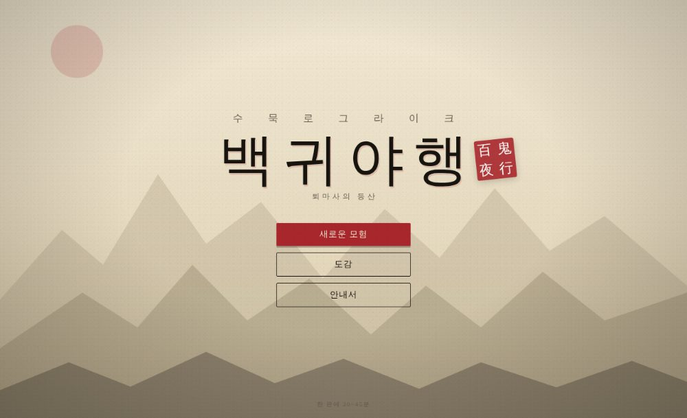

백 년에 한 번, 산이 문을 연다. 올해는 그 문이 닫히지 않았다.
마지막 퇴마사가 되어 부적 열 장을 들고 산을 오른다.

---

## 실행

```bash
xdg-open game/index.html      # 리눅스
open game/index.html          # macOS
start game\index.html         # 윈도우
```

의존성 0개. 이미지·폰트·오디오 파일을 하나도 쓰지 않는다.
그림은 전부 CSS/SVG로 그리고, 효과음은 WebAudio로 그때그때 합성한다.

> 게임 안에도 **안내서**가 들어 있다 (타이틀 → 안내서, 또는 `≡` → 안내서).
> 아래 내용이 그림과 함께 7개 탭으로 정리되어 있다.

---

## 30초 요약

**부적(카드)으로 요괴를 때려잡으며 산을 오르는 턴제 카드 게임이다.**

| | |
|---|---|
| 1. 갈림길 | 지도에서 어느 길로 갈지 고른다 |
| 2. 전투 | 손에 든 부적을 내서 요괴를 쓰러뜨린다 |
| 3. 보상 | 부적 **3장 중 1장**을 골라 덱에 넣는다 |
| 4. 반복 | 12층을 올라 보스를 잡으면 다음 막. **6막**까지 |

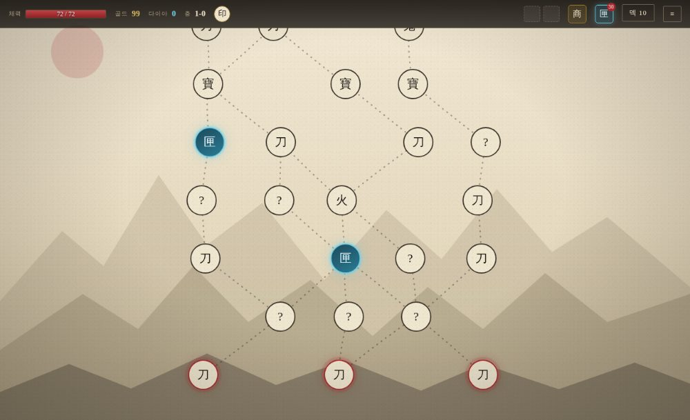

> **덱은 얇을수록 강하다.** 약한 부적을 마구 넣으면 정작 필요한 부적이 손에 안 온다.
> 보상에서 **건너뛰기**도 좋은 선택이고, 상인에게 돈을 주고 부적을 **없앨** 수도 있다.

---

## 전투 읽는 법

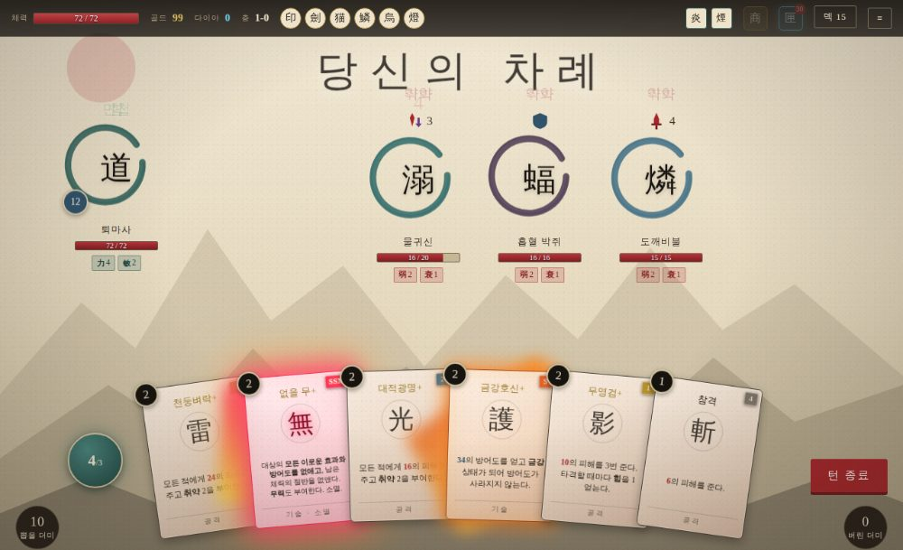

게임 안 안내서에는 같은 화면에 번호가 붙어 있다.

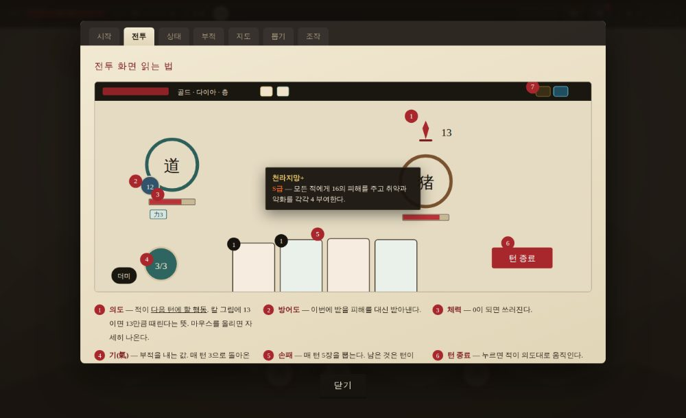

### 가장 중요한 규칙 셋

1. **적의 의도를 먼저 본다.** 적 머리 위 아이콘이 *다음 턴에 할 행동*이다.
   칼 그림에 13이면 13만큼 때린다는 뜻. 마우스를 올리면 자세히 나온다.
2. **방어도는 내 턴이 시작될 때 사라진다.** 미리 쌓는 게 아니라
   *이번에 맞을 만큼만* 그때그때 올리는 것이다. 8을 맞는데 20을 올리면 12는 버려진다.
3. **기(氣)는 매 턴 4로 돌아온다.** 남겨도 이월되지 않으니 다 쓰는 편이 좋다.

### 예상치가 보인다

손패의 부적에 **마우스를 올리면** 그 부적이 실제로 낼 수치가 적 머리 위에 뜬다.
힘·검기·약화·취약을 전부 계산한 값이라 보이는 숫자를 그대로 믿으면 된다.
한 방에 죽는 적은 **처치**라고 표시되고 테두리가 붉게 빛난다.

### 상태 효과

| | |
|---|---|
| 힘 · 민첩 | 공격 피해 / 방어도가 수치만큼 오른다 |
| 취약 | 받는 피해 +50% (턴 끝에 1 감소) |
| 약화 | 주는 피해 −25% (턴 끝에 1 감소) |
| 중독 | 턴 시작에 피해. **방어도를 무시한다** |
| 가시 · 재생 · 금강 · 흡성 … | 게임 안 안내서의 *상태* 탭에 20종 전부 정리되어 있다 |

### 쾌감 요소 — 도파민

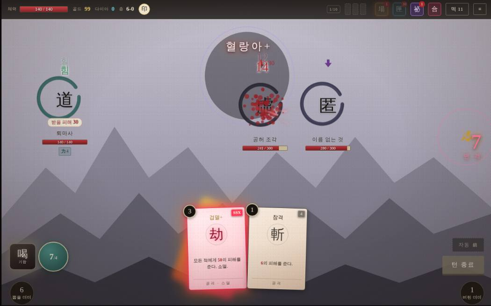

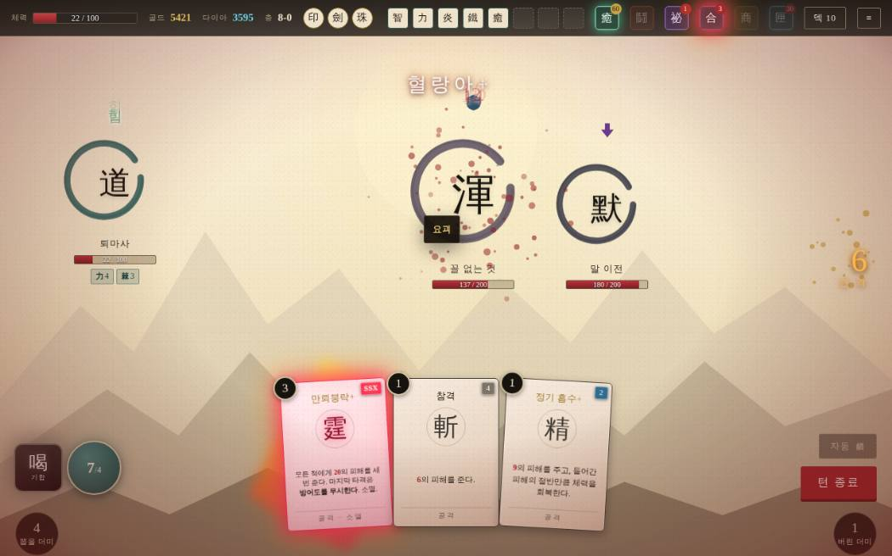

| 언제 | 무슨 일이 |
|---|---|
| 한 방에 **26 이상** 들어가면 | 숫자가 두 배로 커지며 **치 명** 이 뜨고, 화면이 0.15초 멈췄다 떨린다 |
| 한 턴에 부적을 **3장 이상** 이어 내면 | 오른쪽에 **연격 카운터**가 뜨고 음이 반음씩 올라간다 (5부터 금빛, 8부터 화면이 번쩍) |
| **방어도를 정확히 깨면** | 유리 깨지는 소리와 푸른 파편 |
| 남은 체력보다 **훨씬 세게** 눕히면 | **과 잉** — 금빛 폭발과 치명타음 |
| 한 번에 **둘 이상** 눕히면 | *N연속 처치!* · 처치 수만큼 음이 올라가고 금가루가 터진다 |
| 체력이 **30% 아래**로 떨어지면 | 화면 가장자리가 붉게 뛰고 심장 소리가 2초마다 |
| 전리품을 받으면 | 숫자가 **상단바의 골드·다이아 칸으로 날아간다** |
| 보스를 잡으면 | 승리 화면이 열리며 화면이 금빛으로 터지고 개방음 |
| **벨 때마다** | 내 자리에서 요괴까지 **섬광이 그어진다** |
| **묵직하게 맞으면** | 화면 가장자리에서 **붉은 기운이 밀려든다** + 정지 |
| **치명·처치** | 퍼져 나가는 **충격 고리**, 처치 자리에는 **금이 간다** |
| 체력이 18% 아래인 요괴 | 죽기 직전이라 **붉게 떤다** |
| 기를 쓸 때 | 기 구슬이 **움찔 눌린다** |

기존 쾌감 요소

- **처치 연출** — 요괴를 눕히면 `처치`가 뜨고 먹물이 튄다.
  엘리트·보스는 `토벌`과 함께 화면이 번쩍이고, 한 번에 둘 이상이면 **연속 처치**.
- **물약 드랍** — 잡졸 10%, 엘리트·보스 55% 확률로 물약을 떨어뜨린다.
  센 상대일수록 좋은 물약이 나온다.
- **천운(天運)** — 카드를 뽑을 때 **2% 확률**로 덱과 버린 더미의
  기술·심법 부적이 **전부 저절로 펼쳐진다.**

### 타격 연출

공격마다 이름에 어울리는 모션이 붙는다 — 참격은 베는 섬광, 창격은 찌르는 창,
파쇄격은 충격파 고리, 겁화는 치솟는 불길, **천둥벼락은 하늘에서 내리꽂는 번개**,
`없을 무`는 안으로 빨려드는 검은 고리.

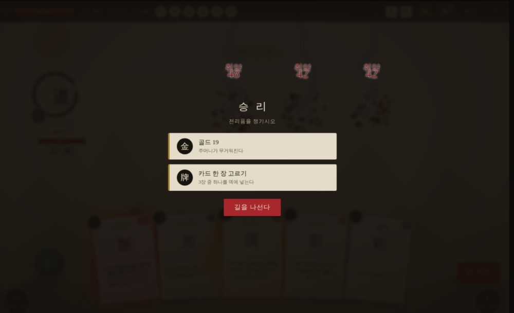

---

## 부적과 등급

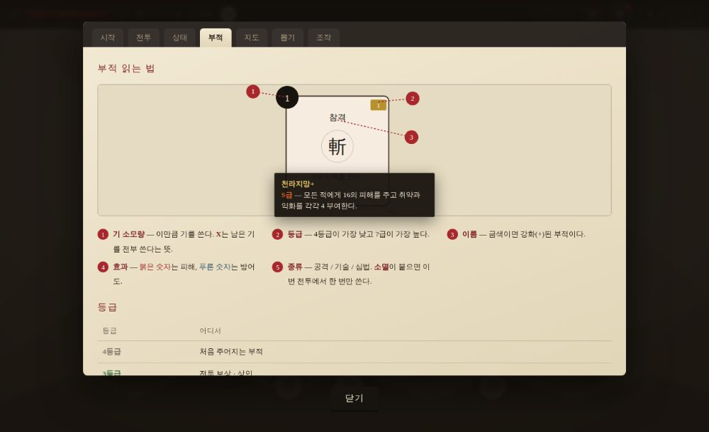

| 등급 | 수 | 어디서 |
|---|---|---|
| 4등급 | 3 | 처음 주어지는 부적 |
| 3등급 | 17 | 전투 보상 (처음부터) |
| 2등급 | 17 | 7층부터 |
| 1등급 | 14 | 2막 6층부터 (엘리트·보스는 더 일찍) |
| **S급** | 12 | 뽑기에서만. 카드에 **불이 붙는다** |
| **SSX급** | 13 | 특대급 상자에서 10% |
| **?급** | 1 | 특대급 상자에서 **0.1%**. 세상에 단 하나 |

등급 사다리는 실제로 측정해서 맞췄다 — 카드 한 장의 값어치(피해 + 방어×0.8 +
카드×6 + 기×9 + 지속 효과 4턴치 + 적에게 건 디버프 − 체력 손실)를 재면
**3등급 1 < 2등급 10 < 1등급 15 < S급 31 < SSX급 81 < ?급 609** 로 줄을 선다.

SSX급 위력은 `없을 무 > 겁멸 > 윤회` 순이다.
`없을 무`는 대상의 이로운 효과와 방어도를 지우고 **남은 체력의 절반**을 없앤다 —
체력 300짜리 보스에게 150. `천지개벽`(?급)은 그 짓을 **모든 적에게** 한다.

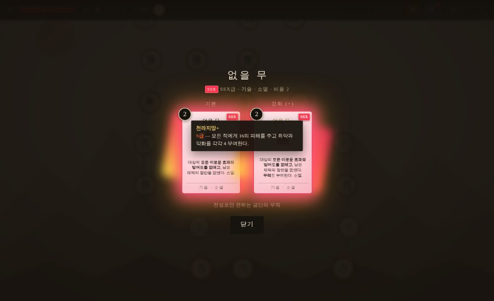

**강화(+)** — 야영지에서 수련하면 부적 하나가 영구히 강해진다 (참격 6 → 참격+ 9).
덱이 두꺼워지면 좋은 부적이 손에 잘 안 오니, 새 부적을 넣기보다
**있는 것을 강화하는 편이 나을 때가 많다.**

---

## 유물

화면 위쪽에 동그랗게 붙는 것들. 한 번 얻으면 **그 판 내내** 효과를 낸다.
**10개까지만** 지닐 수 있고, 자리가 꽉 찬 채로 새 유물을 얻으면 무엇을 버릴지 고르게 된다.

| 등급 | 수 | 어디서 |
|---|---|---|
| 3등급 | 9 | 엘리트 · 보물 · 상인 · 유물 상자 |
| 2등급 | 9 | 〃 |
| 1등급 | 5 | 〃 (테두리가 금빛으로 빛난다) |
| **S급** | 5 | 보스가 남긴다. **불이 붙는다** |
| **SSX급** | 11 | **조합으로만** 얻는다 |

### 조합

재료 유물 **둘을 태워** SSX급 유물 하나로 만든다.
화면 위쪽 `合` 단추를 누르면 조합표가 열리고, 재료가 모이면 단추가 붉게 빛난다.
조합하면 재료 둘이 사라지므로 **자리가 하나 비워진다** — 정리법이기도 하다.

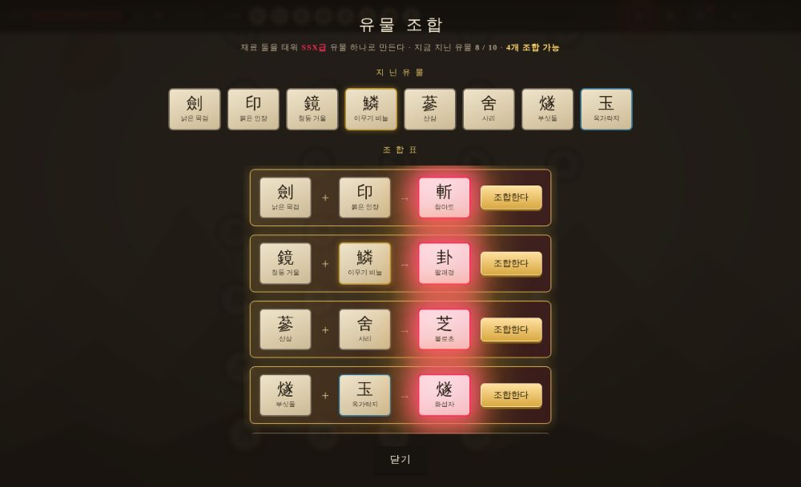

| 재료 | 결과 |
|---|---|
| 낡은 목검 ＋ 붉은 인장 | **참마도** — 힘 3, 첫 공격 피해 +10 |
| 청동 거울 ＋ 이무기 비늘 | **팔괘경** — 받는 피해 −3, 가시 5 |
| 산삼 ＋ 사리 | **불로초** — 최대 체력 +15, 전투 후 12 회복 |
| 부싯돌 ＋ 옥가락지 | **화섭자** — 첫 턴 2장 추가, 물약 쓰면 1장 |
| 스님의 염주 ＋ 사신도 | **금강염주** — 시작 방어 12, 턴마다 6 |
| 도깨비 방망이 ＋ 금괴 | **황금 방망이** — 승리 시 골드 25 / 엘리트 60 |
| 부적 주머니 ＋ 저승사자의 등불 | **귀문 등롱** — 시작 기 2, 두 턴마다 기 1 |
| 백호의 발톱 ＋ 요령 | **백호령** — 첫 턴 힘 4, 전체 약화 2 |
| 삼족오 깃 ＋ 태극 부채 | **삼족오 부채** — 턴마다 7 피해, 3장째에 1장 뽑기 |
| 신선의 표주박 ＋ 향로 | **선단** — 절반 이하 시 35 회복, 정화 가능 |
| 여우구슬 ＋ 산군의 이빨 | **구천의 인장** — 최대 기 +1, 힘 2 · 민첩 2 |

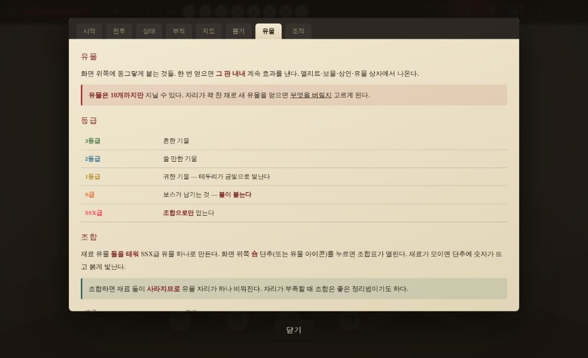

### 도감

여러 판에 걸쳐 만난 부적·유물·요괴가 **영구히** 기록된다. 등급별로 나뉘어 있고,
부적은 누르면 기본과 강화 버전을 나란히 볼 수 있다.

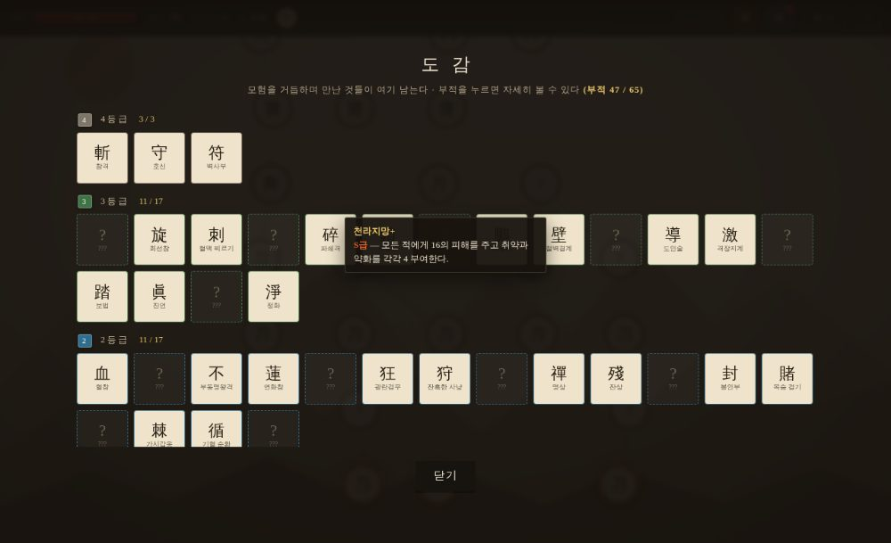

---

## 지도

| | |
|---|---|
| 刀 요괴 | 보통 전투 |
| 鬼 엘리트 | 훨씬 세다. 대신 **유물**을 준다 |
| 火 야영지 | 체력 32% 회복 **또는** 부적 하나 강화 (하나만) |
| 商 상인 | 사고, 돈을 내고 부적을 **없앤다** |
| ? 사건 | 선택지가 있는 이야기 |
| 寶 보물 | 공짜 유물과 골드 |

보스 직전 층은 항상 **야영지**다. 그 전에 체력을 아끼지 말고 써도 된다.
**뽑기(匣)는 지도에 없다** — 화면 위쪽 `匣` 단추로 언제든 간다.

### 부적 등급 해금

전투 보상에 나오는 부적은 산을 오를수록 좋아진다.
**기본(4등급) 부적은 보상에 절대 나오지 않는다.**

| 진행 | 나오는 등급 |
|---|---|
| 처음 ~ 6층 | 3등급 |
| 7층부터 | 3등급 · **2등급** |
| 2막 6층부터 | 3등급 · 2등급 · **1등급** |

**엘리트와 보스**는 한 등급 위까지 미리 내주고, **상인**도 한 등급 앞서 판다.
새 등급이 열리면 화면에 알려 준다.

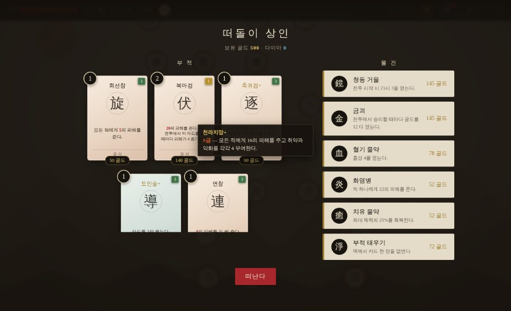

**상인과 뽑기는 화면 위쪽 단추**(`商` / `匣`)로 언제든 갈 수 있다. 전투 중에만 막힌다.
상점 재고는 저장되어 있어 닫았다 다시 열어도 같은 물건이다 (굴리기 악용 방지).

---

## 뽑기

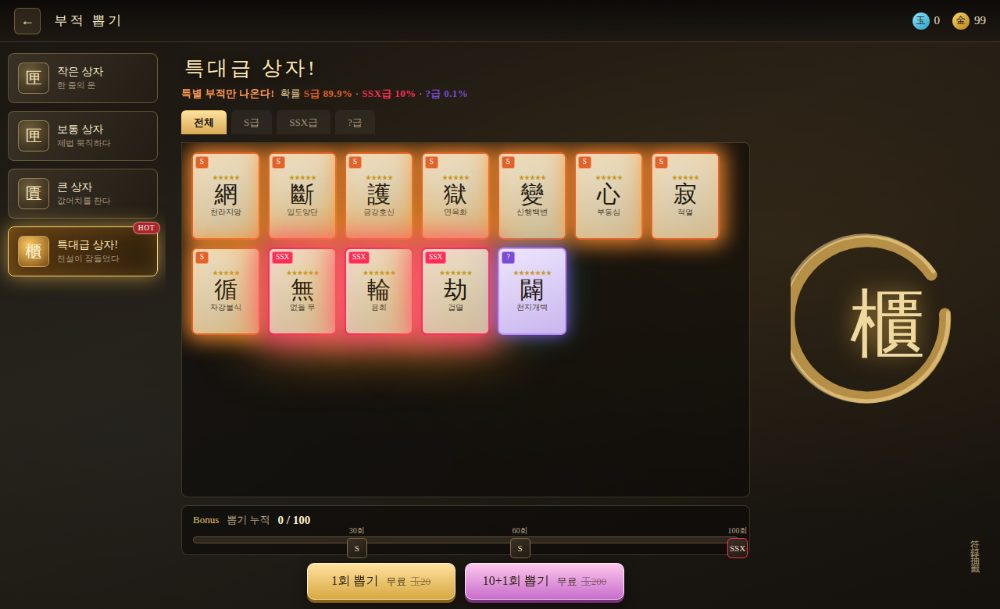

| 상자 | 나오는 것 |
|---|---|
| 작은 · 보통 · 큰 상자 | 다이아 · 부적 · 물약 · 보물 (클수록 좋다) |
| **특대급 상자!** | **반드시 특별 부적** — S급 기본 · SSX급 10% · ?급 0.1% |
| **유물 상자** | **유물만** 나온다. 조합 재료를 모으기 좋다 (상인도 하나씩 판다) |

**누적 보너스** — 뽑을 때마다 막대가 찬다. **30회 · 60회에서 S급**,
**100회에서 SSX급** 부적을 확정으로 하나 더 준다. 100회를 넘으면 처음으로 돌아간다.

상자는 바로 열리지 않는다. 흔들리다가, 빛이 차오르다가, 터진다 —
**좋은 게 나올수록 더 오래 뜸을 들인다.**

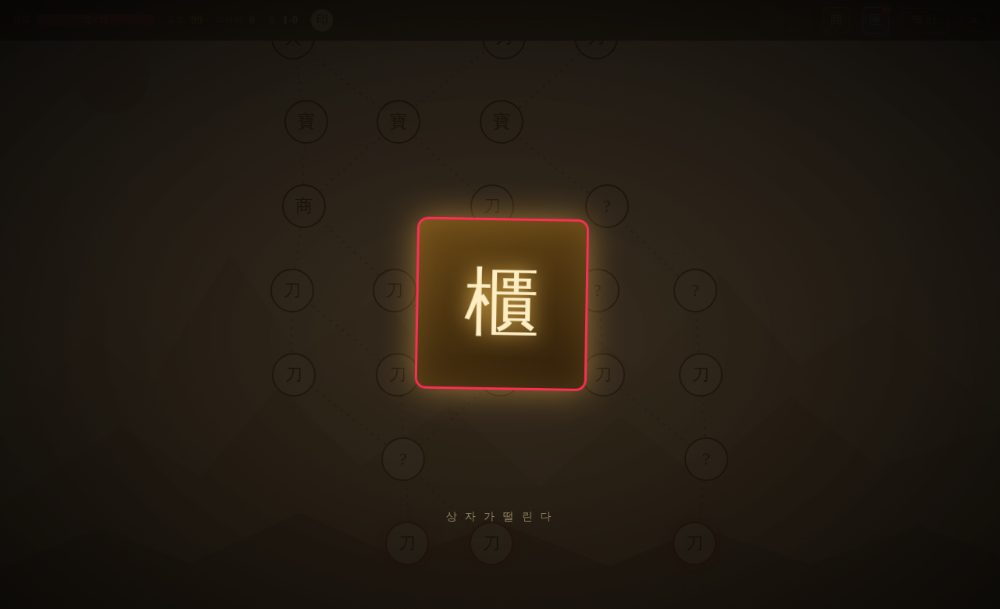
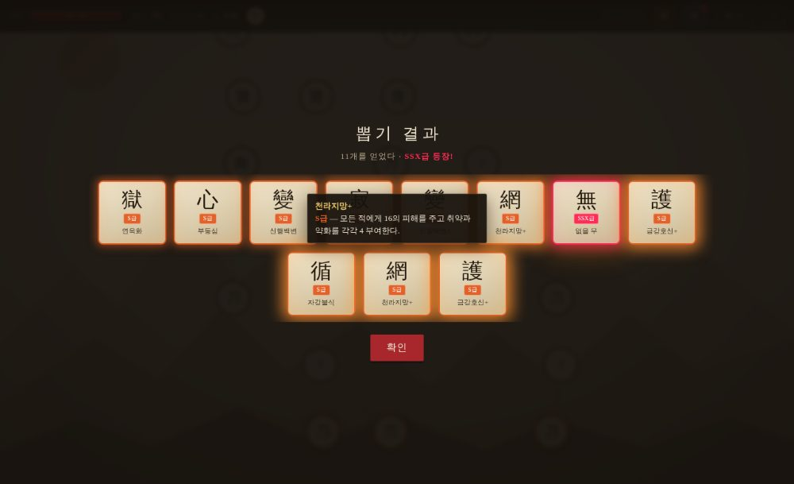

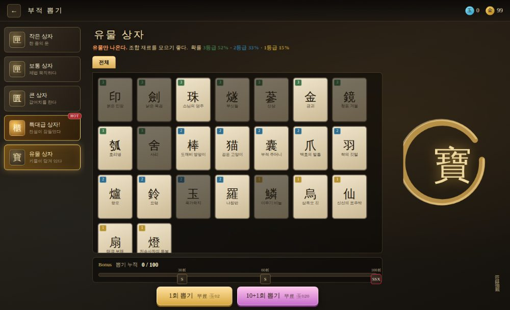

> 지금은 시험 중이라 **뽑기가 무료**다. 그래서 난이도가 많이 헐렁하다.
> 값을 켜려면 소스의 `BOX_FREE = false` 한 줄만 바꾸면 된다 (다이아 3/5/8/20).


### VIP 패키지

뽑기 상점 맨 아래 칸. **지금은 출시 기념으로 값을 받지 않는다.**

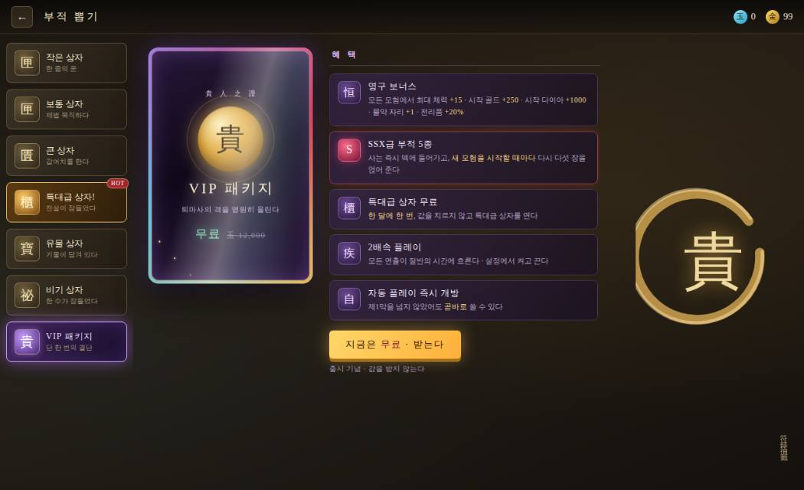

| 혜택 | 내용 |
|---|---|
| **영구 보너스** | 모든 모험에서 최대 체력 +15 · 시작 골드 +250 · 시작 다이아 +1000 · 물약 자리 +1 · 전리품 +20% |
| **SSX급 부적 5종** | 사는 즉시 덱에 들어가고, **새 모험을 시작할 때마다** 다시 다섯 장을 얹어 준다 |
| **특대급 상자 무료** | 한 달에 한 번, 값을 치르지 않고 특대급 상자를 연다 |
| **2배속 플레이** | 모든 연출이 절반의 시간에 흐른다 (설정에서 켜고 끈다) |
| **자동 플레이 즉시 개방** | 제1막을 넘지 않았어도 곧바로 쓸 수 있다 |

구매 카드에는 무지개 아우라가 돈다 — 원뿔 그라디언트 테두리가 6.5초에 한 바퀴,
그 위로 홀로그램 광택이 쓸고 지나가고, 금빛 티끌이 아래에서 피어오른다.
전부 CSS 하나로 그린다. 사고 나면 카드에 **보유 중** 띠가 걸린다.

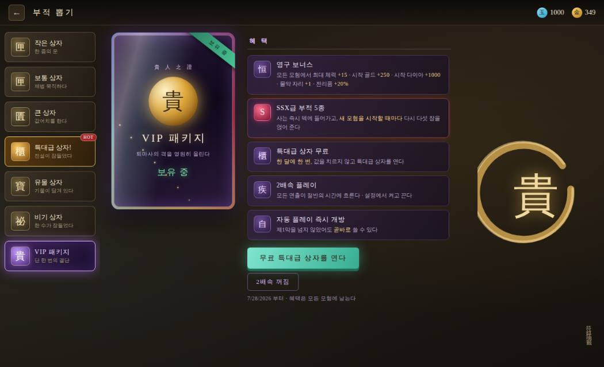

---

## 자동 플레이

**제1막의 보스를 넘어서면 보상으로 열린다.** 한 번 열면 이후 모든 모험에서 쓸 수 있다.

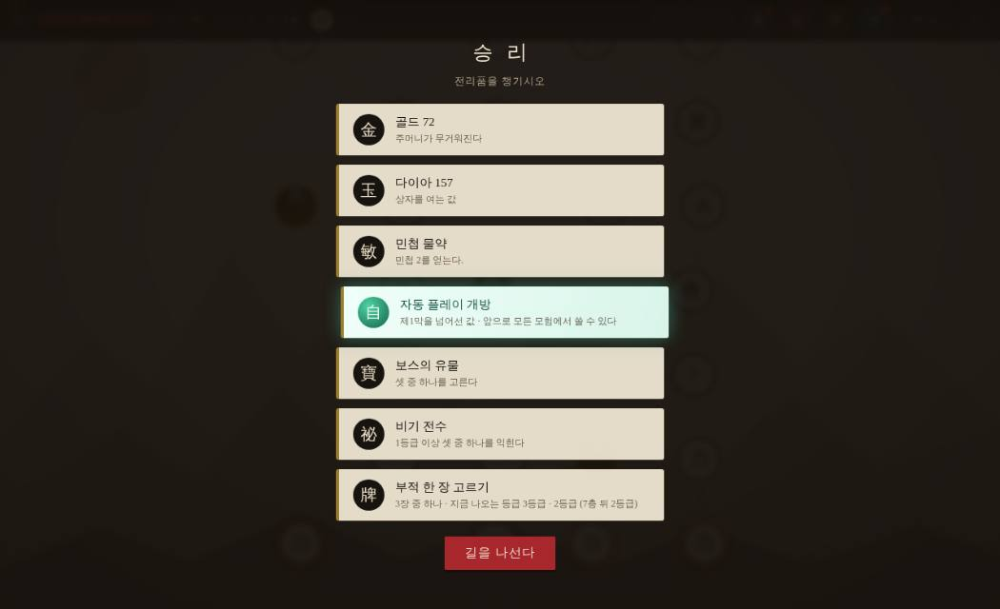
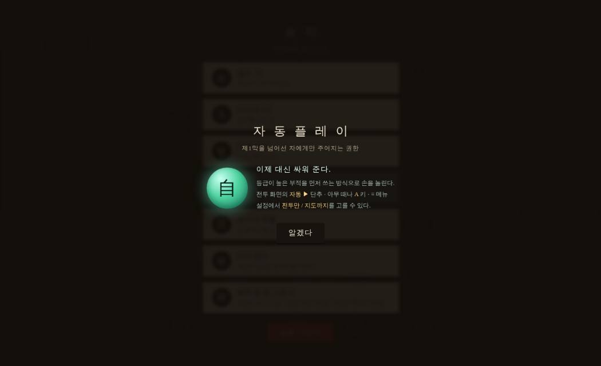

### 핵심은 등급 순서다

> **좋은 부적일수록 먼저 나간다.**

점수는 두 층으로 나뉜다.

| 층 | 폭 | 무엇을 보는가 |
|---|---|---|
| ① 등급 | 한 칸당 **1000점** | 4등급 0 · 3등급 1 · 2등급 2 · 1등급 3 · S급 4 · SSX급 5 · ?급 6 |
| ② 상황 | **±400점** | 마무리 일격(+170) · 이번 턴 받을 피해 대비 방어값 · 심법의 이른 전개 · 강화 여부 · 소멸 페널티 |

②는 ±400으로 묶여 있어 **①의 1000점 차이를 절대 넘지 못한다.**
그래서 등급이 한 칸이라도 높으면 어떤 상황에서도 먼저 쓰이고,
**같은 등급 안에서만** 상황 판단이 순서를 가른다.

실제로 손패를 점수순으로 세워 보면 이렇게 나온다.

```
?급     천지개벽   5988
SSX급   윤회       4988
S급     신행백변   3988
1등급   분신술     2988
2등급   혈참       2034
3등급   연참       1015
4등급   참격         17
```

### 그 밖의 판단

- 기가 모자라 못 내는 부적은 후보에서 빠진다. 낼 게 없으면 턴을 넘긴다.
- 공격 부적의 대상은 **잡을 수 있는 적 → 보스/엘리트 → 이번 턴 때리려는 적** 순으로 고른다.
- **물약은 아낀다.** 체력이 25% 아래이거나 이번 턴에 죽을 만큼 맞을 때만, 그것도 **목숨을 건지는 물약(치유·철갑)만** 딴다.
  한 판에 **일반 전투 1병 · 보스/엘리트/대전투장 2병**이 상한이고, 살릴 물약이 없으면 그냥 아낀다.
- **비기**는 2턴째부터, 보스·엘리트·대전투장이면 3턴째부터, 6턴이 넘으면 무조건 쓴다.
- 부적을 고르는 창이 뜨면 여기서도 **등급이 높은 쪽**을 집는다. (버릴 카드를 고르라면 반대로 가장 낮은 것)
- 유물 자리가 꽉 차면 **가장 등급이 낮은 유물**을 내주고, 새것이 더 낮으면 두고 간다.

### 범위

| 범위 | 하는 일 |
|---|---|
| **전투만** (기본) | 싸움만 대신한다. 이기면 보상 화면 앞에서 스스로 멈춘다 |
| **지도까지** | 갈림길 선택 · 전리품 · 야영지 · 사건 · 보물 · 이야기까지 혼자 나아간다 |

*지도까지*라도 **상점에서는 아무것도 사지 않고 나온다.** 돈 쓰는 일은 사람 몫이다.
장기 상점 · 뽑기 · 대전투장처럼 스스로 정해야 하는 자리에서도 손을 대지 않는다.

*전투만*으로 두면 **싸움이 끝나 지도로 나오는 순간 스스로 꺼진다.**
지도에서는 아예 켜지지도 않는다 — 로비에 자동 표식이 떠 있을 일이 없다.

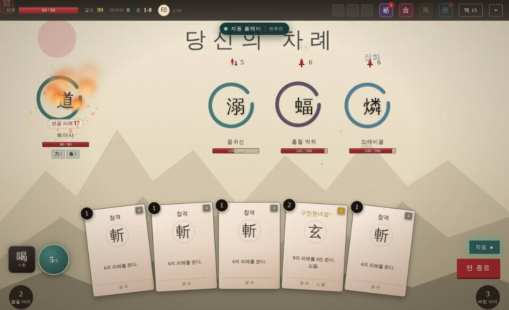

한 수를 두는 간격은 **느긋 1.5초 · 보통 0.85초 · 빠름 0.38초**. 기본은 *보통*이고 설정에서 바꾼다.

켜고 끄기는 전투 화면의 **자동 ▶** 단추, 아무 데서나 **`A`** 키, `≡` 메뉴 셋 다 된다.
켜져 있는 동안은 화면 위쪽에 표식이 떠 있고, 그걸 눌러도 멈춘다.

---

## 설정

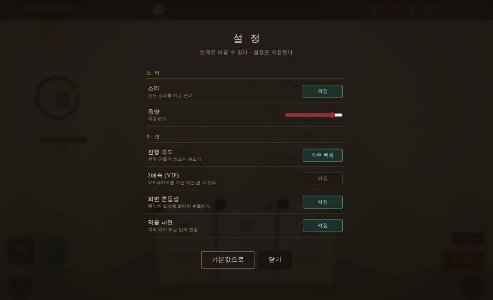

| | |
|---|---|
| 소리 · 음량 | 끄거나 0~100%로 조절 |
| 진행 속도 | 보통 · 빠름 · 아주 빠름 |
| 2배속 (VIP) | 모든 연출이 절반의 시간에 흐른다 |
| 화면 흔들림 | 묵직한 일격의 진동 |
| 먹물 파편 | 피·먹이 튀는 입자 |
| 큰 이름 연출 | 귀한 부적을 쓸 때 이름이 크게 지나간다 |
| 설명 풍선 | 마우스를 올렸을 때의 툴팁 |
| 자동 플레이 | 범위 · 속도(느긋 1.5초 / 보통 0.85초 / 빠름 0.38초) · 물약 자동 사용 · 비기 자동 사용 |
| 도감과 기록 지우기 | 두 번 눌러야 지워진다 (진행 중인 모험은 남는다) |

설정은 전부 저장된다. *기본값으로* 한 번이면 되돌아간다.

---

## 손이 덜 가게

### 모두 받기

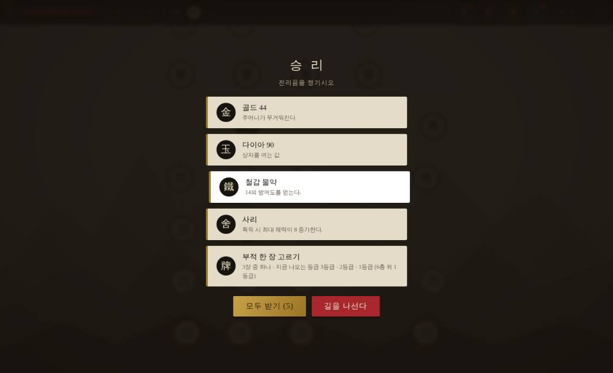

승리 화면에서 **모두 받기** 한 번이면 골드 · 다이아 · 물약 · 유물이 차례로 들어온다.
부적 고르기나 보스 유물처럼 **골라야 하는 것만** 순서대로 창을 띄운다.
남은 개수가 단추에 찍히고, 다 챙기면 *다 챙겼다*로 바뀌며 잠긴다.

### 응급 회복

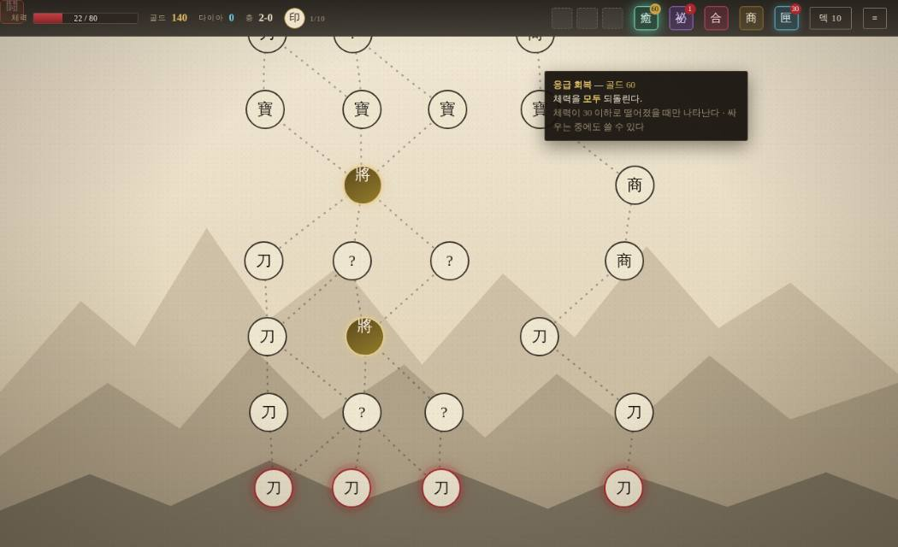

체력이 **30 이하**로 떨어지면 상단에 작은 **癒** 단추가 초록빛으로 뛴다.
**골드 60**에 체력을 **전부** 되돌린다. **싸우는 도중에도 눌린다.**
골드가 모자라면 회색으로 죽어 있고, 체력이 차면 조용히 사라진다.

---

## 첫걸음

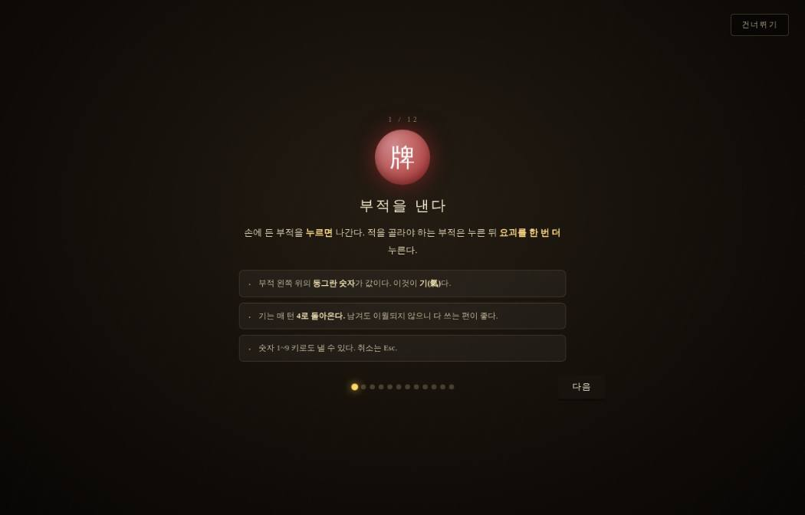

**새 모험을 처음 시작하면** 열두 장의 안내가 흐른다 —
부적 내는 법 · 요괴의 의도 · 방어도 · 턴 · 비기 · 보상 · 유물 · 지도 ·
뽑기와 터 · 도감 · 자동 플레이 · 마지막 인사.

**언제든 건너뛴다** (오른쪽 위 · `Esc`). 점을 눌러 아무 장으로나 건너뛸 수도 있다.
한 번 보면 다시 뜨지 않고, **타이틀 화면과 안내서에서 다시 볼 수 있다.**

---

## 떠돌이 상인

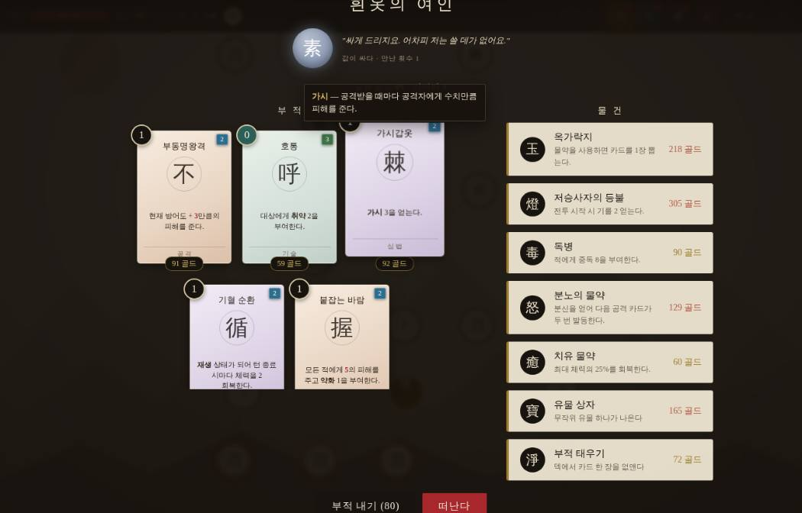

상점마다 **다른 사람이 앉아 있다.** 여섯 명이 저마다 다른 값과 말투를 지녔다.

| 상인 | 값 | 어떤 사람인가 |
|---|---|---|
| **亡 이미 죽은 상인** | **0.70배** | 이미 값을 다 치른 자. 삼막에서 멈췄다 |
| **素 흰옷의 여인** | 0.85배 | 남편이 이 산에 올랐고, 돌아온 건 벽사부 한 장 |
| **童 떠돌이 아이** | 0.92배 | 산에서 태어나 산 밖을 본 적이 없다 |
| **眼 외눈 장수** | 1.00배 | 백 년 전 그 밤에 눈 하나를 잃었다 |
| **鉢 탁발승** | 1.15배 | 위에서 내려왔다. 문 안에는 아무것도 없더라고 |
| **狐 수상한 장사치** | **1.30배** | 꼬리? 무슨 소린가. 옷자락일세 |

**같은 상인을 다시 만나면 이야기가 이어진다.** 세 마디까지 들을 수 있다.

### 부적 내기

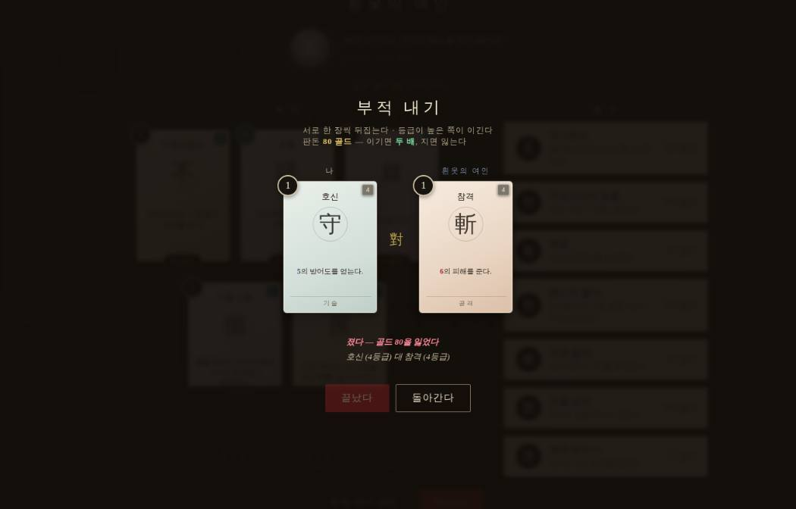

**판돈 80골드.** 서로 한 장씩 뒤집어 **등급이 높은 쪽이 이긴다.**
이기면 두 배, 지면 잃는다. **한 상점에 한 번.**

상인은 자네가 지닌 것과 **비슷한 등급대**에서 꺼내므로, 언제 걸어도 승산은 반반이다
(기본 덱 표본 4000회에서 47.0%). 같은 등급이면 강화(+)와 운이 가른다.

---

## 장기 — 노인과 한 판

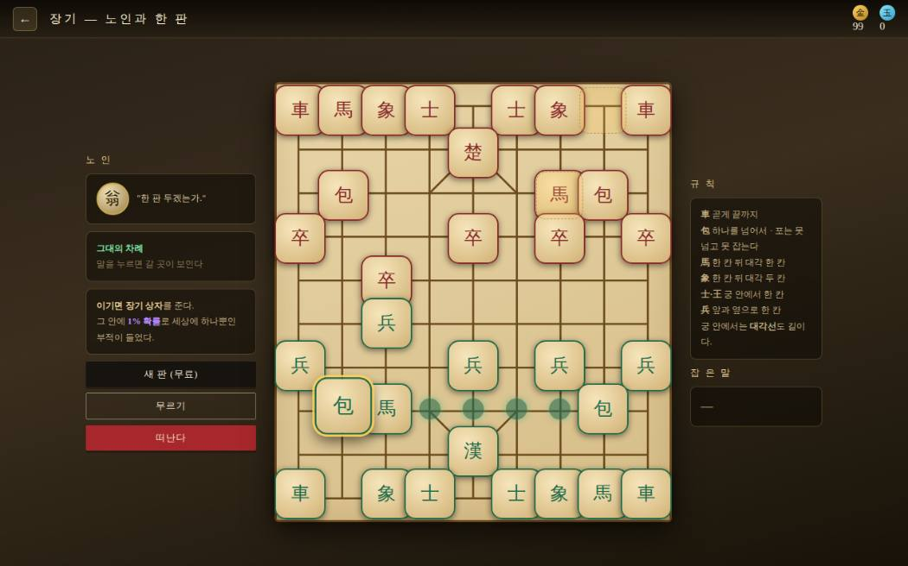

장기 상점은 이제 **진짜 장기판**이다. 9줄 × 10줄, 32말.

| 말 | 길 |
|---|---|
| **車** | 곧게 끝까지 |
| **包** | 정확히 하나를 넘어서 그 너머 아무 데나 · **포는 넘지도 잡지도 못한다** |
| **馬** | 한 칸 간 뒤 대각으로 한 칸 · 첫 칸이 막히면 못 간다 |
| **象** | 한 칸 간 뒤 대각으로 두 칸 · 두 곳 중 하나만 막혀도 못 간다 |
| **士·王** | 궁 안에서 한 칸 |
| **卒·兵** | 앞과 옆으로 한 칸 · 뒤로는 못 간다 |

궁(宮) 안에서는 **대각선도 길**이고, 車와 包도 그 길을 쓴다.
자기 왕이 잡히는 수는 애초에 두지 못한다.

**노인은 알파-베타 가지치기를 붙인 미니맥스로 세 수 앞을 본다.**
잡을 말부터 훑어 가지를 치므로 한 수에 90ms면 끝난다.
말값은 車 130 · 包 70 · 馬 50 · 象·士 30 · 卒 20이고, 졸이 넘어갈수록 값이 오른다.

무르기 · 장군 표시 · 잡은 말 · 마지막 수 표시가 있다. 첫 판은 무료, 다음 판부터 골드 300.

### 장기 상자

이기면 상자를 준다.

| 확률 | 나오는 것 |
|---|---|
| **1%** | **?급 장기(將棋) 부적** |
| 18% | S급 부적 |
| 22% | 유물 |
| 나머지 | 다이아 · 골드 · 물약 |

**?급 장기(將棋)** — <b>50%</b>(강화 65%) 확률로 **모든 적의 체력을 60% 깎는다.**
빗나가면 카드 2장과 기 2를 준다. 소멸.
2만 회 표본에서 1.010%로 확인했다.

---

## 스킨 (皮)

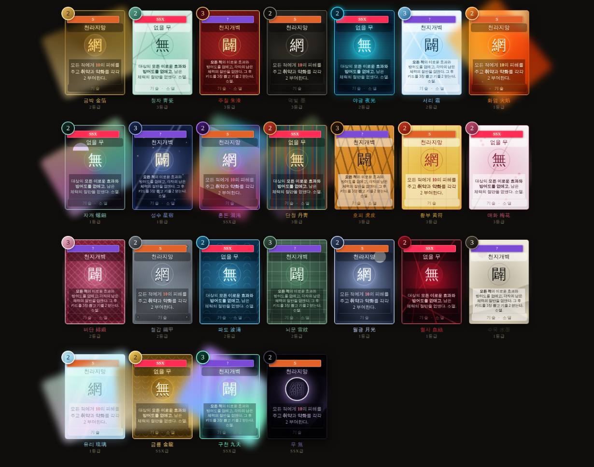

부적의 **겉모습만** 바꾼다. 수치도 비용도 하나도 달라지지 않는다.
**S급 · SSX급 · ?급** 부적에만 입힐 수 있고(30종), 스킨은 **모험을 넘어 남는다.**

| 스킨 | 등급 | 생김새 |
|---|---|---|
| **靑瓷 청자** | 3등급 | 가마에서 갈라진 비취빛 유약. 실금이 그대로 무늬가 되었다 |
| **朱漆 주칠** | 3등급 | 붉은 옻을 여러 겹 올리고 금니로 그렸다 |
| **墨 먹빛** | 3등급 | 갓 갈아 낸 먹이 종이 위에서 아직 번지고 있다 |
| **金箔 금박** | 2등급 | 검은 옻칠 위의 금박. 빛이 스칠 때마다 결이 흐른다 |
| **夜光 야광** | 2등급 | 어둠 속에서 스스로 빛난다 |
| **霜 서리** | 2등급 | 살얼음이 낀 부적. 손끝이 시리다 |
| **火焰 화염** | 1등급 | 아래에서 위로 불티가 계속 피어오른다 |
| **螺鈿 자개** | 1등급 | 검은 칠 위에 박은 자개. 각도마다 빛깔이 다르다 |
| **星宿 성수** | 1등급 | 스물여덟 별자리를 새겼다. 별이 하나씩 깜빡인다 |
| **混沌 혼돈** | SSX급 | 어떤 빛깔이라 부를 수가 없다 |

전부 CSS 하나로 그린다 — 금박의 광택 쓸림, 청자의 빙렬, 먹의 번짐,
야광의 주사선, 화염의 불티 일곱 개, 자개의 무지개 조각, 성수의 별 열둘, 혼돈의 회전.

### 어디서 얻고 어떻게 입히나

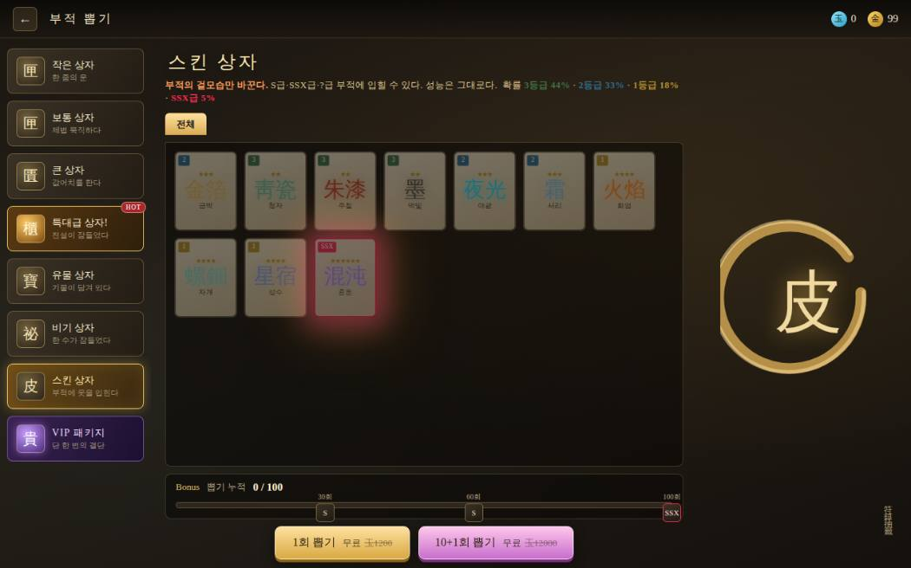

**부적 뽑기(匣)** 맨 아래의 **스킨 상자**에서 나온다.
3등급 44% · 2등급 33% · 1등급 18% · SSX급 5% (2만 회 표본에서 44.0 / 33.4 / 17.8 / 4.8%).
겹치면 다이아 200으로 바꿔 준다.

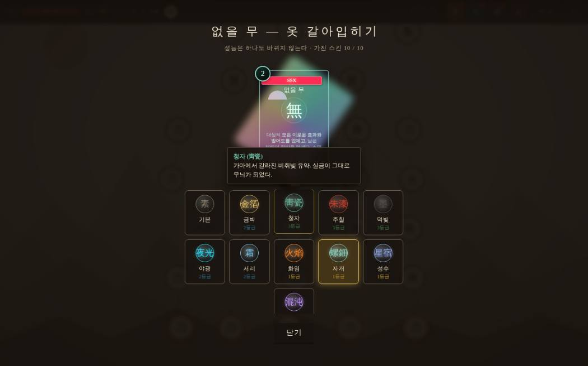

**도감 → 부적을 눌러 상세 → 옷 갈아입히기.** 고른 즉시 미리보기가 바뀌고,
손패·덱·보상·도감 어디서 그려지든 그 옷을 입는다. 언제든 *기본*으로 되돌린다.

**가지지 않은 스킨은 잠긴 채로 보인다** — 흐린 점선 테두리에 `???`.
눌러도 입혀지지 않고, 무엇이 남았는지만 알려 준다.
잠금은 세 겹이다. 고르는 창이 막고, `equipSkin`이 소유를 다시 확인하고,
카드를 그리는 `skinOf`가 마지막으로 한 번 더 본다.

---

## 저주의 서당 (咀呪書堂)

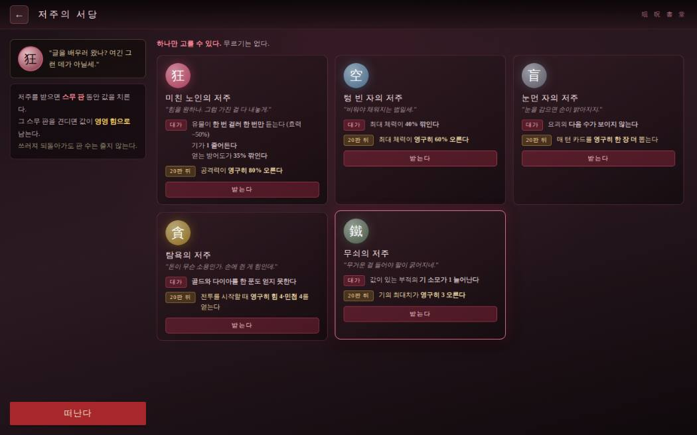

미친 노인이 글을 가르친다는 서당. 실은 저주를 판다.
**이레에 한 번만 문을 연다.**

> 저주를 받으면 **스무 판** 동안 값을 치른다.
> 그 스무 판을 견디면 값이 **영영 힘으로** 남는다.

| 저주 | 대가 | 스무 판 뒤 |
|---|---|---|
| **狂 미친 노인의 저주** | 유물이 **한 번 걸러 한 번만** 듣고(효력 −50%), 기 −1, 얻는 방어도 −35% | **공격력 +80% 영구** |
| **空 텅 빈 자의 저주** | 최대 체력 −40% | 최대 체력 +60% 영구 |
| **盲 눈먼 자의 저주** | 요괴의 다음 수가 보이지 않는다 | 매 턴 카드 +1 영구 |
| **貪 탐욕의 저주** | 골드·다이아를 한 푼도 얻지 못한다 | 전투 시작 시 힘 4·민첩 4 |
| **鐵 무쇠의 저주** | 값이 있는 부적의 기 소모 +1 | 기 최대치 +3 영구 |

남은 판 수는 상단바에 붉은 딱지로 붙고, **세 판** 아래로 남으면 심장이 뛴다.
쓰러져 갈림길로 되돌아가도 판 수는 줄지 않는다. 한 번에 하나만 짊어질 수 있다.

---

## 터 (場)

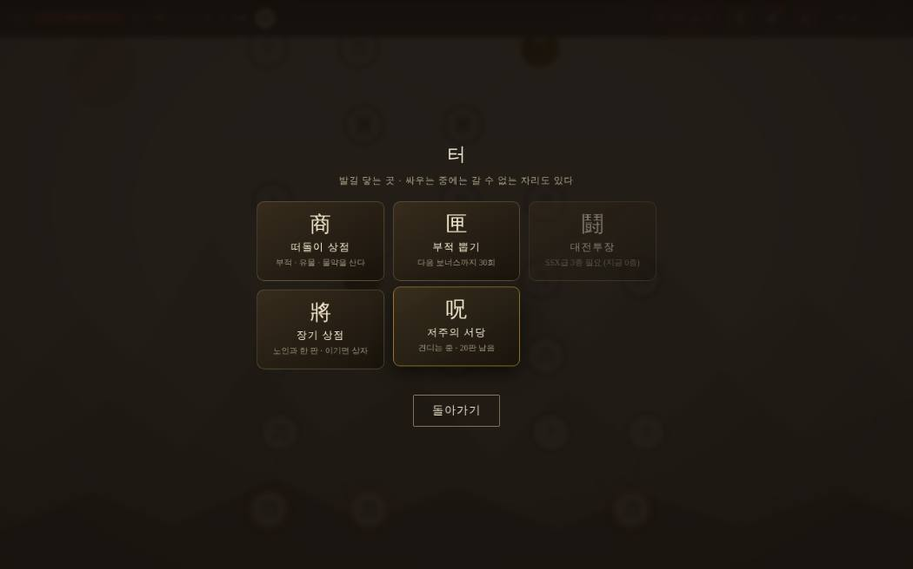

갈 곳이 많아져서 상단바의 商·鬪 를 **場** 하나로 모았다.

**상점 · 대전투장 · 장기 · 저주의 서당** — 이 넷이 여기 있다.
갈 만한 곳이 생기면 場 단추에 표시가 뜬다.

**부적 뽑기(匣)만은 따로 남겨 두었다.** 누적 보너스까지 몇 번 남았는지가
단추에 그대로 찍히므로, 한 칸 건너 들어가게 하면 그 숫자가 묻힌다.

---

## 죽어도 이어진다

**쓰러져도 처음부터가 아니다.** 갈림길에 들어설 때마다 그 순간이 저장되고,
패배 화면에서 *그 갈림길로 돌아간다*를 고르면 그 길에 들어서기 직전 상태
(체력·골드·덱·유물 전부)로 되돌아간다. 창을 닫았다 와도 이어진다.

진행 상황도 자동 저장된다(localStorage). 타이틀에서 *이어서 오르기*.

---

## 이야기

새 모험을 시작하면 **오프닝**이, 보스를 잡으면 **막간 이야기**가 나온다.
한 글자씩 찍히고, 배경은 장면마다 다른 수묵 삽화가 SVG로 그려진다.
언제든 *건너뛰기* 할 수 있다.

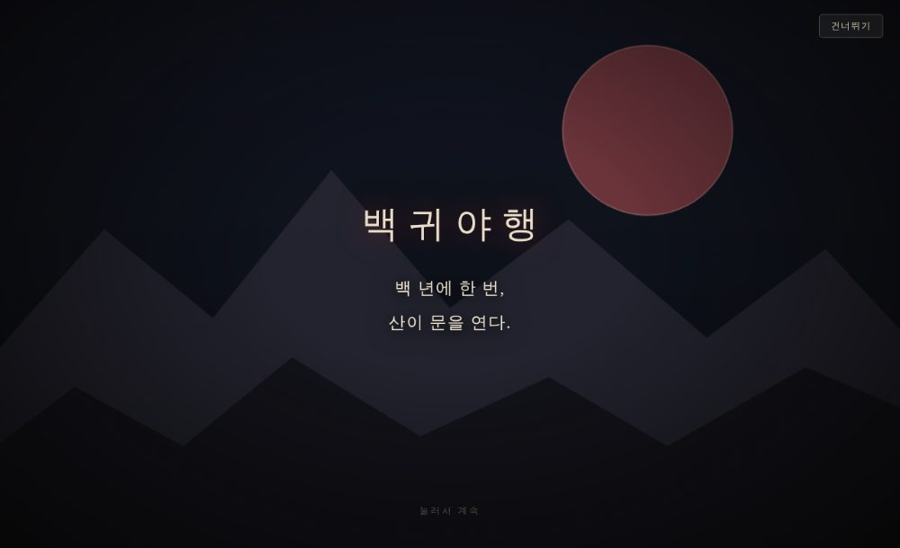
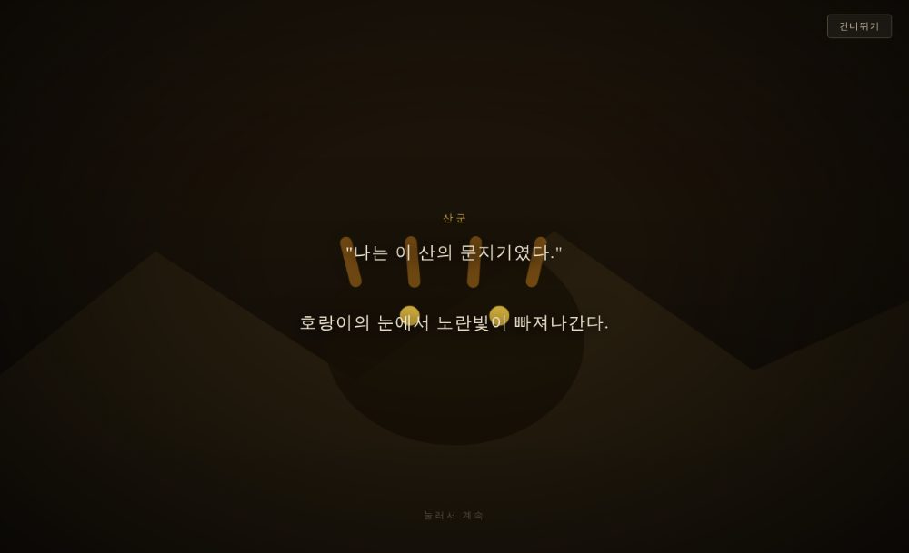

---

## 들어 있는 것

| | |
|---|---|
| 카드 | 105종 (공격·기술·심법·특별·저주) + 전부 강화(+) 버전 |
| 유물 | 39종 — 훅 기반, 등급 5단계, 조합 11종 |
| 물약 | 12종 |
| 요괴 | 65종 — 잡졸 43, 엘리트 16, 보스 8 |
| 비기 | 11종 — 기를 쓰지 않는 한 수, 등급 7단계 |
| 사건 | 9종의 갈림길 이벤트 |
| 저주 | 5종 — 스무 판의 값과 영구 보상 |
| 스킨 | 10종 — 겉모습만 바꾼다, 모험을 넘어 남는다 |
| 구성 | **8막** × 12층 분기 지도 + 보스, 승리 후 **환생**(NG+) 무한 |

### 여덟 봉우리

실제 체력은 아래 표의 값에 **제4막부터 붙는 +10%**가 곱해진 것이다.

| 막 | 이름 | 보스 | 체력 | 기믹 |
|---|---|---|---|---|
| 1 | 요괴 숲 | 구미호 | 128 | 세 턴마다 꼬리가 깨어나 힘이 오른다 |
| 2 | 안개 봉우리 | 산군 | 195 | 4턴마다 기를 모아 다음 턴 **승천격** |
| 3 | 구천 벼랑 | 흑룡 / 염라 | 250 / 238 | 판마다 어느 쪽이 나올지 다르다 |
| 4 | 명계 관문 | 강림도령 | 363 | 다섯 턴마다 **저승 선고**, 세 턴마다 힘이 오른다 |
| 5 | 구천 상계 | 치우천왕 | 462 | 전신을 부른 다음 턴에 **천지분쇄** |
| 6 | 무간 | 무간 | 616 | 다섯 턴마다 무를 모아 다음 턴 **끝**(52) |
| 7 | **무저갱** | 무저(無底) | 704 | 다섯 턴마다 바닥이 당기고, 다음 턴 **삼킴**(58) |
| 8 | **태초** | 태초(太初) | 902 | 다섯 턴마다 숨을 들이쉬고, 다음 턴 **처음**(66) |

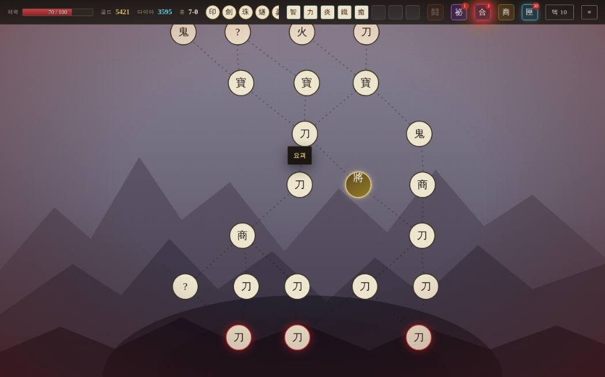
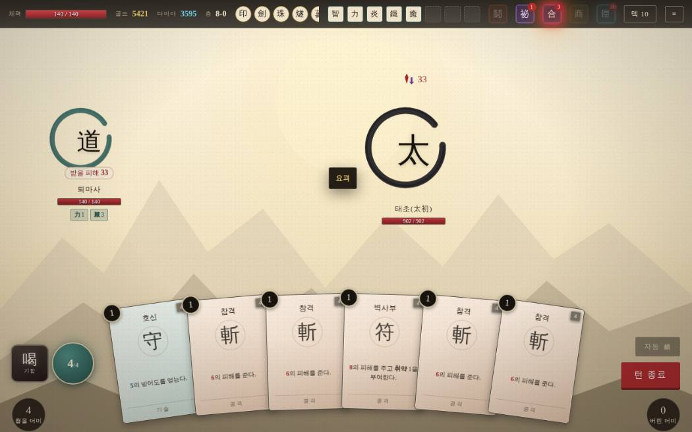

**제7막 무저갱** — 무간이 무너진 자리 아래로 떨어진 것들.
떨어진 것 · 사슬 망령 · 아가리 · 심연의 눈, 엘리트로 잊혀진 왕과 심연의 주인.

**제8막 태초** — 아무것도 없던 자리. 배경이 처음으로 밝아진다.
첫 빛 · 말 이전 · 꼴 없는 것, 엘리트로 태초의 짐승과 이름 짓는 자.

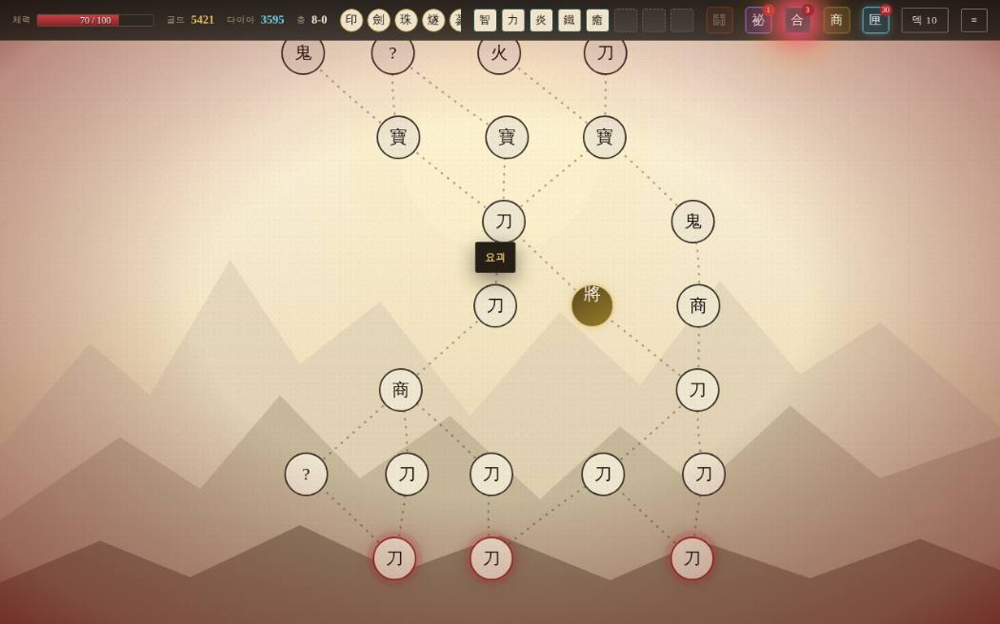

### 막마다 굵어진다

요괴는 위로 갈수록 **체력이 가파르게, 공격력은 완만하게** 오른다.
오래 버티되 한 방에 죽지는 않도록.

| 막 | 1 | 2 | 3 | 4 | 5 | 6 | 7 | 8 |
|---|---|---|---|---|---|---|---|---|
| 체력 | 1.00 | 1.04 | 1.12 | 1.26 | **1.46** | 1.66 | 1.86 | **2.10** |
| 공격력 | 1.00 | 1.02 | 1.06 | 1.12 | **1.20** | 1.28 | 1.36 | **1.45** |

대전투장은 자체 배율을 쓰므로 이 보정을 받지 않는다.

### 제5·6막의 배려

여기서부터는 S급 없이 넘기 어렵다.

- **제5막부터 엘리트가 30% 확률로 S급 부적 셋 중 하나**를 내어 준다. 제6막부터는 **35%**.
- **제5막 보스를 넘으면 특대급 상자를 한 번** 준다. 제6막에는 없다.

---

## 비기(祕技)

기(氣)를 **쓰지 않는** 한 수. 화면 왼쪽 아래 붉은 단추로 발동한다.

> **하나만 장착**할 수 있고, **전투 한 번에 딱 한 번**만 쓸 수 있다.

시작할 때는 **가장 낮은 `기합`(4등급) 하나뿐이다.**
**보스를 잡으면 1등급 이상** 셋 중 하나를 전수받고, **비기 상자**에서도 나온다.

비기 상자 확률: 3등급 28% · 2등급 24% · 1등급 22% · **S급 21%** · **SSX급 4.5%** · **?급 0.5%**

| 등급 | 비기 | 효과 |
|---|---|---|
| 4 | **기합** (시작) | 모든 적에게 12 피해 |
| 3 | 호신강기 | 방어도 28 |
| 2 | 축기 | 기 4 |
| 1 | 연환수 | 카드 4장, 힘 3 |
| S | 기공파 | 모든 적에게 32 피해 |
| S | 철벽 | 방어도 45, 이번 턴 받는 피해 절반 |
| S | 속공 | 카드 5장, 기 3 |
| **SSX** | **만천귀장** | **기의 제한을 깨고** 뽑을·버린 더미의 모든 부적을 태운다. 태운 장수 × 9 피해 |
| **SSX** | 무념무상 | 이번 턴 **모든 부적의 기 소모가 0** |
| **SSX** | 역천 | 모든 적의 이로운 효과를 지우고 현재 체력의 40%를 없앤다 |
| **?** | 회광반조 | 체력을 전투 시작 시점으로 되돌리고 손패 7장 + 기 5 |

---

## 조작

| | |
|---|---|
| 부적 사용 | 부적 클릭 → (대상이 필요하면) 적 클릭 |
| 취소 | 우클릭 / `Esc` |
| 단축키 | `1`~`9` 부적, `E` 또는 `Space` 턴 종료, `D` 덱 보기, **`A` 자동 플레이** |
| 메뉴 | 우상단 `≡` — 자동 플레이, 설정, 대전투장, 장기 상점, 비기, 상점, 뽑기, 덱, 도감, 안내서, 모험 포기 |

---

## 구조

단일 HTML이지만 안은 구획이 나뉘어 있다.

```
0.  코어      난수(시드 기반 mulberry32), WebAudio 합성, 먹물 파티클, 툴팁
              — 소리는 master→컴프레서 뒤에 컨볼버 잔향 send 를 두고,
                같은 효과음도 매번 음정·길이를 흔들어 기계적으로 들리지 않게 한다
1.  상태이상  20종의 버프/디버프 정의 (이름·설명·감소 규칙)
3.  카드      defCard — 수치 v(u) 하나로 설명문과 실제 효과를 함께 만든다
4.  유물      defRelic — battleStart/turnStart/modAtk/modTaken… 훅으로 개입
5.  물약      defPot
6.  적        defEnemy — 행동표 + next(e) AI. 의도(intent)는 미리 뽑아 공개한다
              — 8개 막, 제4막부터 체력·공격력 +10% 보정
7.  전투 엔진 피해 계산 → 방어도 → 상태이상 → 사망 처리, async 턴 진행
7-B 자동 플레이 등급(×1000) + 상황(±400) 점수로 손패를 세운다. 창이 떠도 스스로 처리
8.  렌더링    부채꼴 손패, 조준 베지어 화살, 타격 연출 14종, 화면 흔들림
9.  지도 생성 6개의 등산로를 굴려 만드는 분기 그래프 (간선이 교차하지 않는다)
10~11         진행 · 보상 · 상점 · 야영지 · 뽑기
12            사건 / 12-B 이야기 (수묵 삽화 SVG + 타자기)
13~14         안내서 · 도감 · 결과 · 타이틀 · 부팅
```

카드를 하나 더 넣고 싶으면 `defCard({...})` 한 덩어리만 추가하면 된다.
보상 풀·상점 재고·도감에 자동으로 편입된다. 적도 `defEnemy` + `ENCOUNTERS` 등록이면 끝.

---

## 검증

헤드리스 Chromium으로 아래를 전부 돌렸고, 모두 오류 0건이다.

| 검사 | 결과 |
|---|---|
| 카드 79종 × 강화 전/후를 실제 전투에서 사용 | 158 / 158 |
| 비기 11종 실행 + 전투당 1회 제한 | 정상 |
| 4~6막 전 조우 48개 · 모든 행동 | 정상 |
| 적 AI가 400턴 동안 유효한 행동만 고르는지 | 이상 없음 |
| 유물 39종의 전 훅 + 물약 12종 사용 | 이상 없음 |
| 조합 11종 — 재료·결과 무결성, 실제 조합, 합성품 훅 | 이상 없음 |
| 유물 자리 초과 시 버리기 선택 | 정상 |
| 지도 200회 생성 — 고아 노드 / 막다른 길 / 보스 도달 불가 | 0건 |
| 1~3막 전 조우 자동 플레이 | 전부 정상 종료 |
| 타격 연출 14종이 카드마다 뜨는지 | 빠짐 없음 |
| 특대급 상자 확률 10만 회 표본 | S 89.94% · SSX 9.96% · ?급 0.094% |
| 상점 재고가 다시 열어도 유지되는지 | 유지됨 |
| 쓰러진 뒤 되돌아가기 — 체력·골드·덱·진행도 복원 | 정확히 일치 |
| 오프닝 · 막간 이야기 · 건너뛰기 | 정상 |
| 승리 → 환생 → 저장/이어하기 | 정상 |
| 효과음 20종 · 잔향 · 배경 바람 | 전부 정상 재생 |
| 자동 플레이 우선순위 — 7등급을 섞은 손패의 점수 순서 | ?급 > SSX > S > 1 > 2 > 3 > 4등급, 예외 없음 |
| 자동 플레이 *전투만* — 이기고 보상 화면 앞에서 멈추는지 | 정상 |
| 자동 플레이 *지도까지* — 무인 전주행 (8막 구성으로 다시) | 최고 5막 53층 도달, **멈춤 0회** |
| 상점·장기·뽑기에서 멋대로 돈을 쓰지 않는지 | 사지 않고 나온다 |
| 설정 13줄 전부 눌러 값 변경·저장·적용 | 파티클 0/30 · 흔들림 off/on · 툴팁 off/on · 음량 반영 |
| 자동 플레이 잠금 → 1막 보스 보상으로 개방 | 잠김 상태에서 거부, 보상 클릭 시 개방 |
| VIP 구매 — 체력 80→95 · 골드 +250 · 다이아 +1000 · 물약칸 +1 · SSX 5장 | 새 모험에도 그대로 적용 |
| VIP 2배속이 실제로 절반인지 | 300ms → 150ms |
| 자동 플레이가 지도에서 켜지지 않고, 승리 후 스스로 꺼지는지 | 정상 |
| 자동 플레이 물약 절제 — 물약 6병, 체력 12로 시작 | 일반 전투 1병 · 보스 2병에서 멈춤 |
| 모두 받기 — 전리품 5개 일괄 수령 | 5/5 수령, 고르는 것만 창을 띄움 |
| 응급 회복 — 나타남/사라짐 · 골드 부족 · 전투 중 사용 | 체력 30 이하에만 뜨고, 60골드에 완전 회복 |
| 새 부적 14종이 보상 풀·도감에 편입되는지 | 전부 편입 |

이 과정에서 실제로 잡은 버그들:

- 전투가 끝나 상태가 비워진 뒤 마우스 이벤트·사망 처리가 이어져 터지던 크래시 2건
- 물약 아이콘이 상단바의 밝은 글자색을 물려받아 보이지 않던 문제
- 손패가 화면 아래로 잘리고, 방어도 배지가 상태이상 표시와 겹치던 문제
- **보상에서 카드를 고르면 보상 화면 자체가 사라져 진행이 막히던 문제** —
  오버레이를 화면(교체형)과 모달(중첩형) 두 계층으로 분리해 해결했다.
  같은 이유로 Esc는 이제 모달만 닫는다.
- **상단바의 대전투장 단추가 화면 왼쪽 위로 튀어나가 체력 바를 덮던 문제** —
  대전투장 *화면*의 `.arena{position:absolute}` 규칙이 같은 이름을 쓰는 *단추*에도
  걸리고 있었다. 단추 쪽 이름을 갈라 두고, 유물 칸도 줄바꿈 대신 가로 스크롤로 바꿨다.
- **고르는 창이 닫히면서 그 아래 보상 화면까지 함께 지워질 수 있던 문제** —
  "맨 위 창을 닫는다"가 아니라 "자기 자신을 닫는다"로 바꿨다(`closePanel`).
- **유물이 10칸 꽉 찬 상태에서 보스 유물이나 상점 유물을 고르면 선택이 먹히지 않던 문제** —
  자리 비우기 창이 뜨자마자 바깥 창이 닫히거나 다시 그려지면서 함께 지워지고 있었다.
  자리 비우기 창을 한 박자 늦게 띄우도록 고쳤다.
